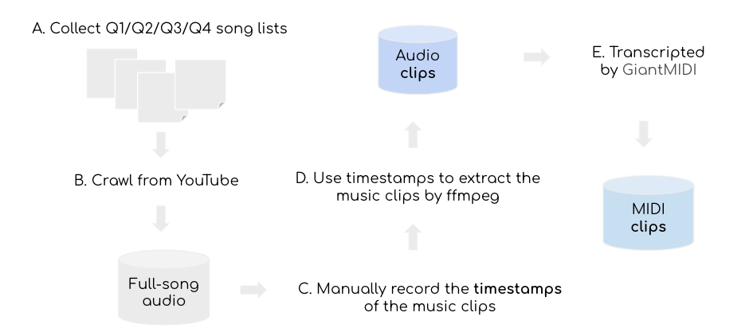
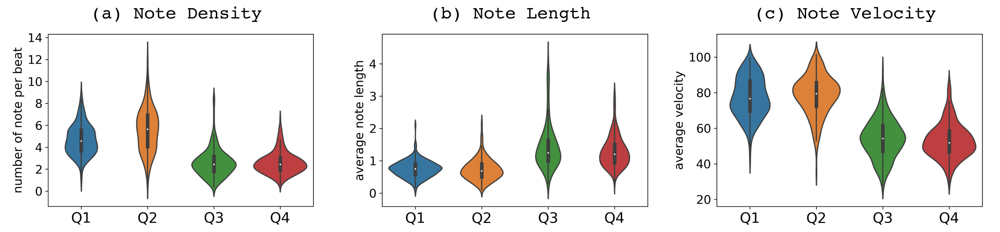
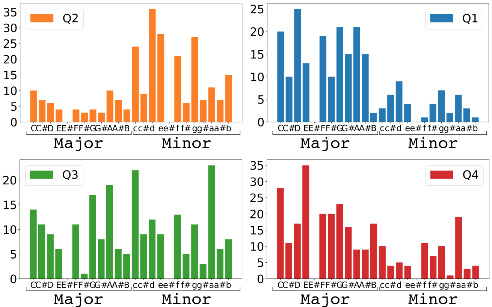
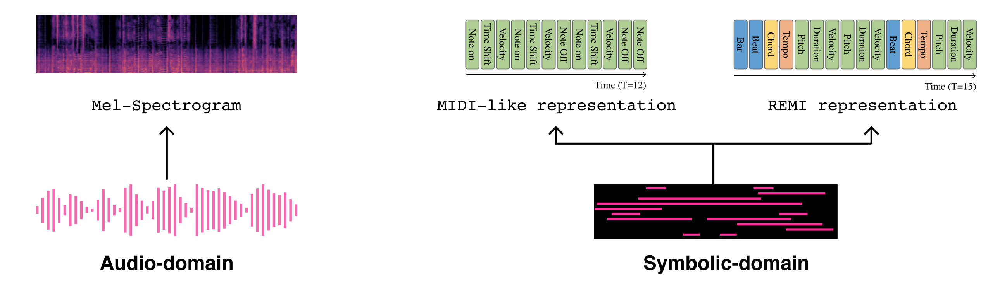
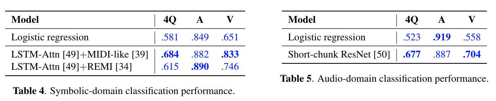
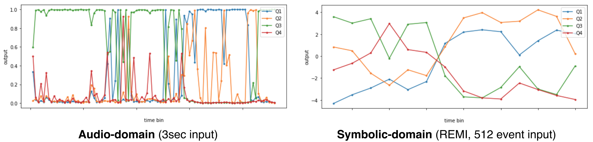
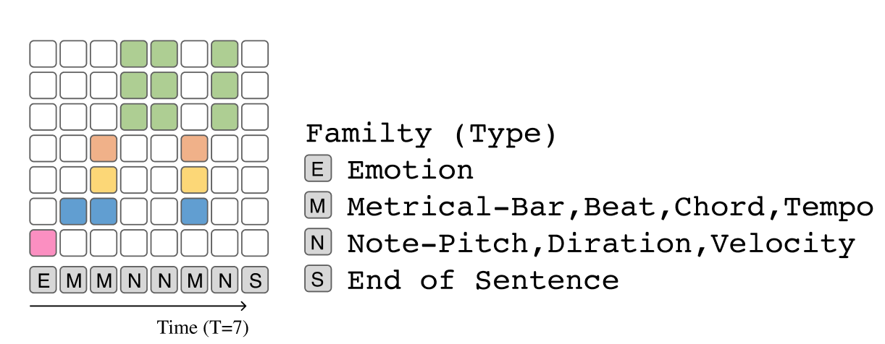

# EMOPIA

EMOPIA  (pronounced  ‘yee-mò-pi-uh’)  dataset is a  shared multi-modal (audio and MIDI) database focusing on perceived emotion in **pop piano music**, to facilitate research on  various  tasks  related  to  music  emotion. The dataset contains **1,087** music clips from 387 songs and **clip-level** emotion  labels  annotated by four dedicated  annotators. Since the clips are not restricted to one clip per song, they can also be used for song-level analysis.   

The detail of the methodology  for  building  the  dataset please refer to our paper.      

* [Paper on Arxiv](https://arxiv.org/abs/2108.01374)
* [Dataset on Zenodo](https://zenodo.org/record/5090631#.YPPo-JMzZz8)
* [Code for classification](https://github.com/SeungHeonDoh/EMOPIA_cls)
* [Code for generation](https://github.com/annahung31/EMOPIA)


### Example of the dataset

<table class="VA-example" style="width:100%" cellspacing="0" cellpadding="0">
  <tr>
    <td style="text-align: center; vertical-align: middle;"></td>
  	<td style="text-align: center; vertical-align: middle;">Low Valence</td>
    <td style="text-align: center; vertical-align: middle;">High Valence</td>
  </tr>

  <tr>

  <td style="text-align: center; vertical-align: middle;">High Arousal</td>
  <!-- Q2 -->
  <td style="text-align: center; vertical-align: middle;">
    <iframe class="resp-iframe"  src="https://www.youtube.com/embed/61EA0xRX8gE?start=61" title="YouTube video player" frameborder="0" allow="accelerometer; autoplay; clipboard-write; encrypted-media; gyroscope; picture-in-picture" allowfullscreen></iframe>
    <figcaption><strong>Q2</strong></figcaption>
  </td>

  <!-- Q1 -->
  <td style="text-align: center; vertical-align: middle;">
  <iframe class="resp-iframe"  src="https://www.youtube.com/embed/6Uf9XBUD3wE?start=97" title="YouTube video player" frameborder="0" allow="accelerometer; autoplay; clipboard-write; encrypted-media; gyroscope; picture-in-picture" allowfullscreen>
    </iframe>
  <figcaption><strong>Q1</strong></figcaption>
  </td>
  </tr>


  <!-- <tr>
    <td style="text-align: center; vertical-align: middle;"></td>
  	<td style="text-align: center; vertical-align: middle;">Q3</td>
    <td style="text-align: center; vertical-align: middle;">Q4</td>
  </tr> -->

  <tr>

  <td style="text-align: center; vertical-align: middle;">Low Arousal</td>

  <!-- Q3 -->
  <td style="text-align: center; vertical-align: middle;">
    <iframe class="resp-iframe"  src="https://www.youtube.com/embed/Ie5koh4qvJc?t=233" title="YouTube video player" frameborder="0" allow="accelerometer; autoplay; clipboard-write; encrypted-media; gyroscope; picture-in-picture" allowfullscreen>
    </iframe>
    <figcaption><strong>Q3</strong></figcaption>
  </td>
  <!-- Q4 -->
    <td style="text-align: center; vertical-align: middle;">
    <iframe class="resp-iframe"  src="https://www.youtube.com/embed/1fdxsFbnsX4" title="YouTube video player" frameborder="0" allow="accelerometer; autoplay; clipboard-write; encrypted-media; gyroscope; picture-in-picture" allowfullscreen>
    </iframe>
    <figcaption><strong>Q4</strong></figcaption>
  </td>
    
  </tr>

</table>


### Number of clips
The following table shows the number of clips and their average length for each quadrant in Russell’s valence-arousal emotion space, in EMOPIA.  
<div align="center">
<table class="num-table" cellspacing="0" cellpadding="0">
  <tr>
    <th>Quadrant</th>
    <th># clips</th>
    <th>Avg. length (in sec / #tokens)</th>
  </tr>
  <tr>
    <td>Q1</td>
    <td>250</td>
    <td>31.9 / 1,065</td>
  </tr>
  
  <tr>
    <td>Q2</td>
    <td>265</td>
    <td>35.6 / 1,368</td>
  </tr>
  
  <tr>
    <td>Q3</td>
    <td>253</td>
    <td>40.6 / 771</td>
  </tr>

  <tr>
    <td>Q4</td>
    <td>310</td>
    <td>38.2 / 729</td>
  </tr>
</table>
</div>

### Pipeline of data collection
<div align="left">
  
  <figcaption><strong>Fig.1</strong></figcaption>
</div>


### Dataset Analysis

<div align="left">
  
  <figcaption><strong>Fig.2</strong> Violin plots of the distribution in (a) note density, (b) length, and (c) velocity for clips from different classes.</figcaption>
</div>

<div align="center">
  
  <figcaption><strong>Fig.3</strong> Histogram of the keys (left / right: major / minor 249 keys) for clips from different emotion classes.</figcaption>
</div>


## Emotion Classification

* We performed emotion classification task in audio domain and symbolic domain, respectively.

* Our baseline approach is logistic regression using handcraft features. For the symbolic domain, note length, velocity, beat note density, and key were used, and for the audio domain, an average of 20 dimensions of mel-frequency cepstral co-efficient(MFCC) vectors were used.

<div align="center">
  
  <figcaption><strong>Fig.4</strong> symbolic-domain and audio domain representation.</figcaption>
</div>

* The input representation of the deep learning appraoch uses mel-spectrogram for the audio domain and midi-like and remi for the symbolic domain.

<div align="center">
  
  <figcaption><strong>Fig.5</strong> results of emotion classification.</figcaption>
</div>

* We adopt the [A Structured Self-attentive Sentence Embedding](https://arxiv.org/abs/1703.03130) for symbolic-domain classification network, and adopt the [Short-chunk CNN + Residual](https://arxiv.org/abs/2006.00751) for audio-domain classification network.


<div align="center">
  
  <figcaption><strong>Fig.6</strong> inference example of Sakamoto: Merry Christmas Mr. Lawrence</figcaption>
</div>

* An inference example is Sakamoto: [Sakamoto: Merry Christmas Mr. Lawrence](https://www.youtube.com/watch?v=zOUlPrCRlVMab_channel=RyuichiSakamoto-Topic). The emotional change in the first half and second half of the song is impressive. The front part is clearly low arousal and the second half turns into high arousal. Impressively, audio and mid classifiers return different inference results.

For the classification codes, please refer to [SeungHeon's repository](https://github.com/SeungHeonDoh/EMOPIA_cls).

The pre-trained model weights are also in the repository.

## Conditional Generation

* We adopt the [Compound Word Transformer](https://github.com/YatingMusic/compound-word-transformer) for emotion-conditioned symbolic music generation using EMPOIA. The CP+emotion representation is used as the data representation.

* In the data representation, we additionally consider the “emotion” tokens and make it a new family. The prepending approach is motivated by [CTRL](https://arxiv.org/abs/1909.05858).

<div align="center">
  
  <figcaption><strong>Fig.7</strong> Compound word with emotion token
  </figcaption>
</div> <br>


* As the size of EMOPIA might not be big enough, we use additionally the [AILabs1k7 dataset](https://github.com/YatingMusic/compound-word-transformer) compiled by Hsiao et al. to pre-train the Transformer. 

* You can download the model weight of the pre-trained Transformer from [here](https://drive.google.com/file/d/19Seq18b2JNzOamEQMG1uarKjj27HJkHu/view?usp=sharing).


* The following are some generated examples for each Quadrant:  

<h3>Q1 (High valence, high arousal)</h3>

<table class="audio-table">
  <tbody>
    <tr>
      <td>Baseline</td>
      <td><audio controls=""><source src="./assets/audio_samples/1_lstm+GA/Q1/gen_Q1_1.mp3" type="audio/mpeg" /></audio></td>
      <td><audio controls=""><source src="./assets/audio_samples/1_lstm+GA/Q1/gen_Q1_2.mp3" type="audio/mpeg" /></audio></td>
      <td><audio controls=""><source src="./assets/audio_samples/1_lstm+GA/Q1/gen_Q1_3.mp3" type="audio/mpeg" /></audio></td>
    </tr>
    <tr>
      <td>Transformer w/o pre-training</td>
      <td><audio controls=""><source src="./assets/audio_samples/2_Transformer/Q1/Q1_1.mp3" type="audio/mpeg" /></audio></td>
      <td><audio controls=""><source src="./assets/audio_samples/2_Transformer/Q1/Q1_2.mp3" type="audio/mpeg" /></audio></td>
      <td><audio controls=""><source src="./assets/audio_samples/2_Transformer/Q1/Q1_3.mp3" type="audio/mpeg" /></audio></td>
    </tr>
  </tbody>
  <tfoot>
    <tr>
      <td>Transformer w/ pre-training</td>
      <td><audio controls=""><source src="./assets/audio_samples/3_Pre-trained_Transformer/Q1/Q1_1.mp3" type="audio/mpeg" /></audio></td>
      <td><audio controls=""><source src="./assets/audio_samples/3_Pre-trained_Transformer/Q1/Q1_2.mp3" type="audio/mpeg" /></audio></td>
      <td><audio controls=""><source src="./assets/audio_samples/3_Pre-trained_Transformer/Q1/Q1_3.mp3" type="audio/mpeg" /></audio></td>
    </tr>
  </tfoot>
</table>


<h3>Q2 (Low valence, high arousal)</h3>

<table class="audio-table">
  <tbody>
    <tr>
      <td>Baseline</td>
      <td><audio controls=""><source src="./assets/audio_samples/1_lstm+GA/Q2/gen_Q2_1.mp3" type="audio/mpeg" /></audio></td>
      <td><audio controls=""><source src="./assets/audio_samples/1_lstm+GA/Q2/gen_Q2_2.mp3" type="audio/mpeg" /></audio></td>
      <td><audio controls=""><source src="./assets/audio_samples/1_lstm+GA/Q2/gen_Q2_3.mp3" type="audio/mpeg" /></audio></td>
    </tr>
    <tr>
      <td>Transformer w/o pre-training</td>
      <td><audio controls=""><source src="./assets/audio_samples/2_Transformer/Q2/Q2_1.mp3" type="audio/mpeg" /></audio></td>
      <td><audio controls=""><source src="./assets/audio_samples/2_Transformer/Q2/Q2_2.mp3" type="audio/mpeg" /></audio></td>
      <td><audio controls=""><source src="./assets/audio_samples/2_Transformer/Q2/Q2_3.mp3" type="audio/mpeg" /></audio></td>
    </tr>
  </tbody>
  <tfoot>
    <tr>
      <td>Transformer w/ pre-training</td>
      <td><audio controls="">
          <source src="./assets/audio_samples/3_Pre-trained_Transformer/Q2/Q2_1.mp3" type="audio/mpeg" />
          </audio></td>
      <td><audio controls=""><source src="./assets/audio_samples/3_Pre-trained_Transformer/Q2/Q2_2.mp3" type="audio/mpeg" /></audio></td>
      <td><audio controls=""><source src="./assets/audio_samples/3_Pre-trained_Transformer/Q2/Q2_3.mp3" type="audio/mpeg" /></audio></td>
    </tr>
  </tfoot>
</table>


<h3>Q3 (Low valence, low arousal)</h3>

<table class="audio-table">
  <tbody>
    <tr>
      <td>Baseline</td>
      <td><audio controls=""><source src="./assets/audio_samples/1_lstm+GA/Q3/gen_Q3_1.mp3" type="audio/mpeg" /></audio></td>
      <td><audio controls=""><source src="./assets/audio_samples/1_lstm+GA/Q3/gen_Q3_2.mp3" type="audio/mpeg" /></audio></td>
      <td><audio controls=""><source src="./assets/audio_samples/1_lstm+GA/Q3/gen_Q3_3.mp3" type="audio/mpeg" /></audio></td>
    </tr>
    <tr>
      <td>Transformer w/o pre-training</td>
      <td><audio controls=""><source src="./assets/audio_samples/2_Transformer/Q3/Q3_1.mp3" type="audio/mpeg" /></audio></td>
      <td><audio controls=""><source src="./assets/audio_samples/2_Transformer/Q3/Q3_2.mp3" type="audio/mpeg" /></audio></td>
      <td><audio controls=""><source src="./assets/audio_samples/2_Transformer/Q3/Q3_3.mp3" type="audio/mpeg" /></audio></td>
    </tr>
  </tbody>
  <tfoot>
    <tr>
      <td>Transformer w/ pre-training</td>
      <td><audio controls=""><source src="./assets/audio_samples/3_Pre-trained_Transformer/Q3/Q3_1.mp3" type="audio/mpeg" /></audio></td>
      <td><audio controls=""><source src="./assets/audio_samples/3_Pre-trained_Transformer/Q3/Q3_2.mp3" type="audio/mpeg" /></audio></td>
      <td><audio controls=""><source src="./assets/audio_samples/3_Pre-trained_Transformer/Q3/Q3_3.mp3" type="audio/mpeg" /></audio></td>
    </tr>
  </tfoot>
</table>


<h3>Q4 (High valence, low arousal)</h3>

<table class="audio-table">
  <tbody>
    <tr>
      <td>Baseline</td>
      <td><audio controls=""><source src="./assets/audio_samples/1_lstm+GA/Q4/gen_Q4_1.mp3" type="audio/mpeg" /></audio></td>
      <td><audio controls=""><source src="./assets/audio_samples/1_lstm+GA/Q4/gen_Q4_2.mp3" type="audio/mpeg" /></audio></td>
      <td><audio controls=""><source src="./assets/audio_samples/1_lstm+GA/Q4/gen_Q4_3.mp3" type="audio/mpeg" /></audio></td>
    </tr>
    <tr>
      <td>Transformer w/o pre-training</td>
      <td><audio controls=""><source src="./assets/audio_samples/2_Transformer/Q4/Q4_1.mp3" type="audio/mpeg" /></audio></td>
      <td><audio controls=""><source src="./assets/audio_samples/2_Transformer/Q4/Q4_2.mp3" type="audio/mpeg" /></audio></td>
      <td><audio controls=""><source src="./assets/audio_samples/2_Transformer/Q4/Q4_3.mp3" type="audio/mpeg" /></audio></td>
    </tr>
  </tbody>
  <tfoot>
    <tr>
      <td>Transformer w/ pre-training</td>
      <td><audio controls=""><source src="./assets/audio_samples/3_Pre-trained_Transformer/Q4/Q4_1.mp3" type="audio/mpeg" /></audio></td>
      <td><audio controls=""><source src="./assets/audio_samples/3_Pre-trained_Transformer/Q4/Q4_2.mp3" type="audio/mpeg" /></audio></td>
      <td><audio controls=""><source src="./assets/audio_samples/3_Pre-trained_Transformer/Q4/Q4_3.mp3" type="audio/mpeg" /></audio></td>
    </tr>
  </tfoot>
</table>


## Authors and Affiliations

* Hsiao-Tzu (Anna) Hung   
Research Assistant @ Academia Sinica / MS CSIE student @National Taiwan University   
r08922a20@csie.ntu.edu.tw  
[website](https://annahung31.github.io/), [LinkenIn](https://www.linkedin.com/in/hsiao-tzu-%EF%BC%88anna%EF%BC%89-hung-09829513a/). 

* Joann Ching  
Research Assistant @ Academia Sinica  
joann8512@gmail.com  
[website](https://joann8512.github.io/JoannChing.github.io/)

* Seungheon Doh 
Ph.D Student @ Music and Audio Computing Lab, KAIST  
seungheondoh@kaist.ac.kr  
[website](https://seungheondoh.github.io/), [LinkenIn](https://www.linkedin.com/in/dohppak/) 

* Juhan Nam
associate professor @ KAIST
juhan.nam@kaist.ac.kr  
[Website](https://mac.kaist.ac.kr/~juhan/)
 
* Yi-Hsuan Yang  
Chief Music Scientist @ Taiwan AI Labs / Associate Research Fellow @ Academia Sinica  
affige@gmail.com, yhyang@ailabs.tw  
[website](http://mac.citi.sinica.edu.tw/~yang/)   


## Cite this dataset


```
@inproceedings{
         {EMOPIA},
         author = {Hung, Hsiao-Tzu and Ching, Joann and Doh, Seungheon and Kim, Nabin and Nam, Juhan and Yang, Yi-Hsuan},
         title = {{EMOPIA}: A Multi-Modal Pop Piano Dataset For Emotion Recognition and Emotion-based Music Generation},
         booktitle = {Proc. Int. Society for Music Information Retrieval Conf.},
         year = {2021}
          }
```
